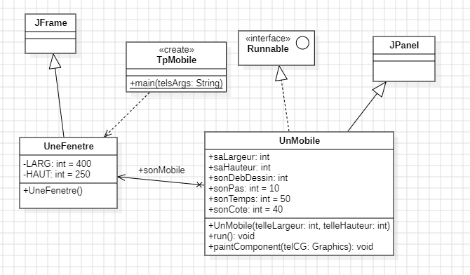

Gouabi Assia  
INF3

# Rapport programmation avancée

  
Ce document permet de mettre en avant ce qui a été vu lors des séances de TD en cours de programmation avancée

       

## Plan
- ### [I - Introduction](#p1)
- ### [II - Théorie](#p2)
- ### [III - Diagramme des classes](#p3)
- ### [IV - TP](#p4)

   

----------

   

###  I - Introduction

Le document suivant à pour but d'effectuer un compte rendu des séances de TD. On incluera à celui-ci des explications , des diagrammes effectués et des conclusions apportées. 

 

###  II - Théorie

Nous avons commencer par étudier l'architecture de la machine qui se trouve en face de nous.

SALLE G25 :

- Processeur : Intel(R) Core(TM) i7-4790 CPU @ 3.60GHz   3.60 GHz
- RAM installée : 8 GO
- 4ème génération
- 4 coeurs 8 threads
- Capacité mémoire 32 GB
- Cache 8 MG Intel Smart cache

SALLE I21 :

L'architecture est semblable à celle de la salle G25, à l'exception de la taille de la RAM qui est de 16 Go. Cela signifie que les performances seront plus rapides, et qu'un code développé dans la salle G25 fonctionnera sans problème dans la salle I21. Cependant, l'inverse n'est pas forcément vrai.

###  III - Diagramme des classes 

Nous avons identifier 3 classes : UneFenetre, UnMobile et TpMobile. Nous avons également l'interface Runnable ainsi que les classes JFrame et JPanel. 
 
TpMobile dépend de la classe une fenêtre puisque dans cette même classe on appelle une nouvelle fenêtre. 
 
UneFenetre hérite de la classe mère JFrame. De plus, on s'aperçoit qu'on a un mobile en tant qu'attribut de la classe UneFenetre. Il y a donc une association entre les classes UneFenetre et UnMobile. 
 
Enfin, la classe UnMobile hérite de la classe mère JPanel et utilise l'interface Runnable. 
En appliquant tout ce qui vient d'être énumérer, on obtient le diagramme suivant : 
 

###  IV - TP

En TP, nous avons commencé à rédiger le constructeur de la classe UneFenetre 