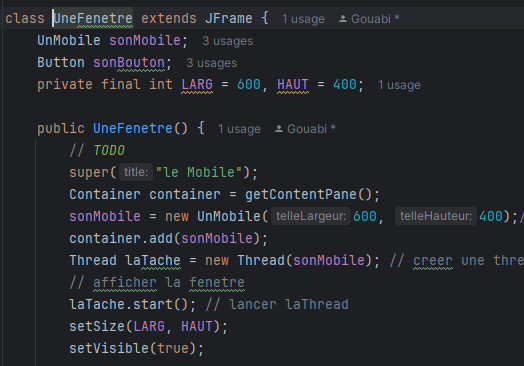
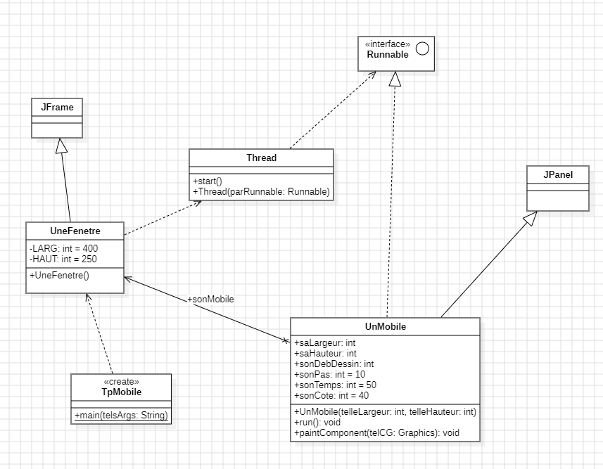
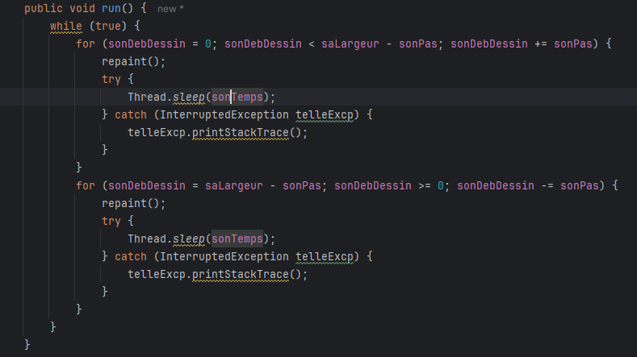

Gouabi Assia  
INF3

# Rapport programmation avancée

  
Ce document permet de mettre en avant ce qui a été vu lors des séances de TP de programmation avancée

       

## Plan
- ### [I - Introduction](#p1)
- ### [II - TP](#p2)
- ### [Première séance de TP ](#p3)
- ### [Deuxième séance de TP ](#p4)

   

----------

   

###  I - Introduction

Le document suivant à pour but d'effectuer un compte rendu des séances de TP. On incluera à celui-ci des explications , les diagrammes effectués et les conclusions apportées. 

###  II - TP 

####  Première séance de TP 

En TP, nous avons commencé par effectuer le diagramme des classes du projet en se basant sur le code des classes que l'on possède. 
  

 
*figure 1 : Diagramme de classes*
  
Nous avons identifier 3 classes : UneFenetre, UnMobile et TpMobile. Nous avons également l'interface Runnable ainsi que les classes JFrame et JPanel.
 
TpMobile dépend de la classe une fenêtre puisque dans cette même classe on appelle une nouvelle fenêtre.
 
UneFenetre hérite de la classe mère JFrame. De plus, on s'aperçoit qu'on a un mobile en tant qu'attribut de la classe UneFenetre. Il y a donc une association entre les classes UneFenetre et UnMobile.
 
Enfin, la classe UnMobile hérite de la classe mère JPanel et utilise l'interface Runnable.
En appliquant tout ce qui vient d'être énumérer, on obtient le diagramme ci-dessus.
 

 Par la suite, nous avons commencé à rédiger le constructeur de la classe UneFenetre

*figure 2 : Constructeur de la classe UneFenetre*
  
Nous avons créer un composant graphique, un mobile appelé <i>sonMobile</i> et l'avons ajouter au conteneur principal de la fenêtre. Le mobile sera donc affiché dans ce conteneur. Une fois cette étape effectuée, on créé un Thread *laTache* en lui passant le mobile précédemment créé. Puis, on lance le Thread.

####  Deuxième séance de TP

Nous avons commencé par ajouter la classe Thread dans le diagramme de classes, ce qui nous donne l'image suivante : 
  

*figure 3 : Diagramme de classes avec la classe Thread et l'interface Runnable*
  
La classe Thread possède un contructeur qui utilise un objet parRunnable de l'interface Runnable, c'est pour cela que la classe Thread dépend de l'interface Runnable. Elle possède également une méthode start qui permet de démarrer le Thread. 
La classe UneFenetre dépend de cette classe car dans son contructeur on appelle la méthode start de la classe Thread. 

  Dans une seconde partie de la séance, nous avons essayé de faire en sorte que le mobile aille de gauche à droite (ce qui était déjà fait) puis de droite à gauche. Dans un premier temps, nous avons identifié la partie du code qui effectué cette action. Elle se trouve dans la méthode run de la classe UnMobile. Ainsi, nous avons ajouter la partie du code suivante :
  

*figure 4 : Méthode run de la classe UnMobile*

En fin de séance il s'agissait dans le constructeur de la classe UneFenetre d'ajouter un bouton permettant d'arrêter ou continuer la course du mobile avec les méthodes suspend() et resume().  