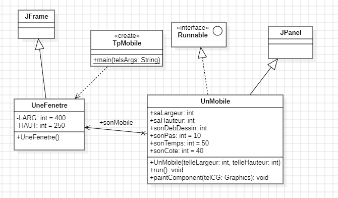
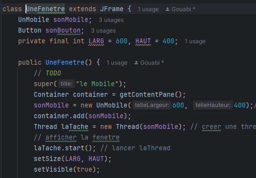
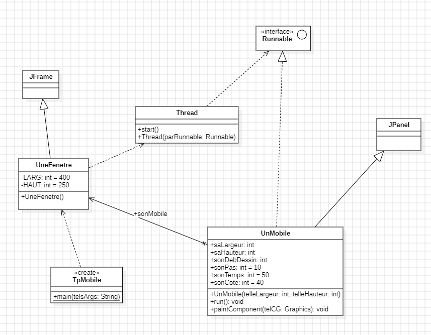
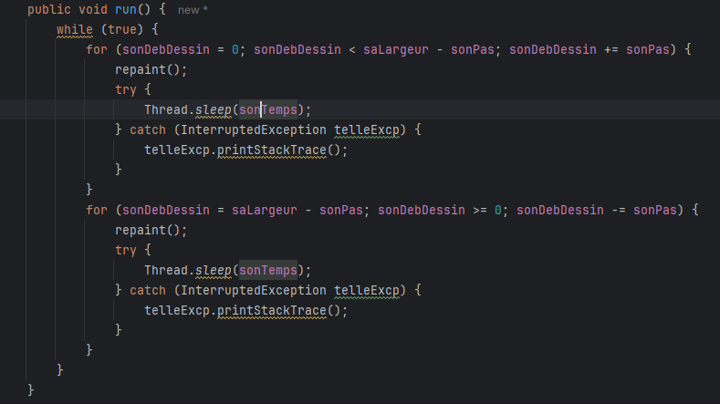
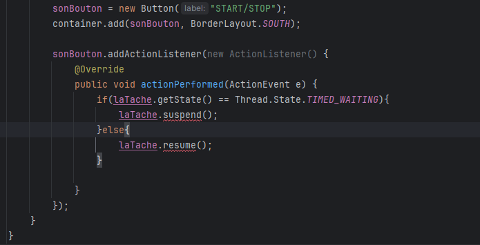
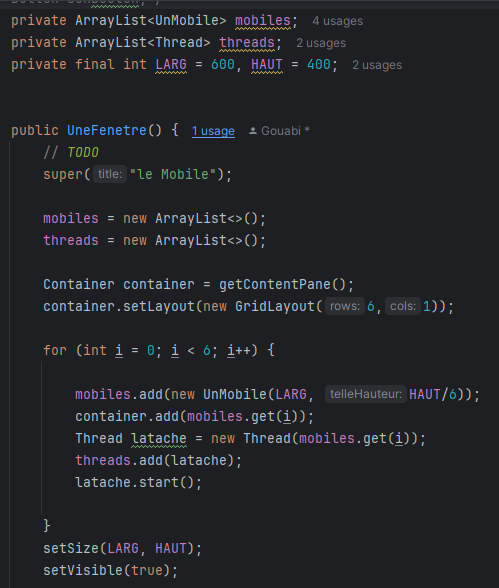
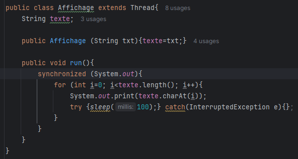
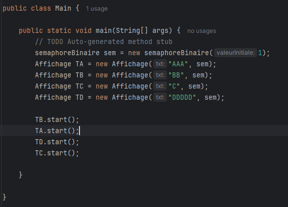

Gouabi Assia  
INF3

# Rapport programmation avancée

  
Ce document permet de mettre en avant ce qui a été vu lors des séances de TP de programmation avancée

       

## Plan
- ### [I - Introduction](#p1)
- ### [II - TP](#p2)
- ### [Première séance de TP ](#p3)
- ### [Deuxième séance de TP ](#p4)

   

----------

   

###  I - Introduction

Le document suivant à pour but d'effectuer un compte rendu des séances de TP. On incluera à celui-ci des explications , les diagrammes effectués et les conclusions apportées. 

###  II - TP 

### TP 1 : Introduction aux threads avec des mobiles 

###  Première séance de TP 

En TP, nous avons commencé par effectuer le diagramme des classes du projet en se basant sur le code des classes que l'on possède. 
  

 
*figure 1 : Diagramme de classes*
  
Nous avons identifier 3 classes : UneFenetre, UnMobile et TpMobile. Nous avons également l'interface Runnable ainsi que les classes JFrame et JPanel.
 
TpMobile dépend de la classe une fenêtre puisque dans cette même classe on appelle une nouvelle fenêtre.
 
UneFenetre hérite de la classe mère JFrame. De plus, on s'aperçoit qu'on a un mobile en tant qu'attribut de la classe UneFenetre. Il y a donc une association entre les classes UneFenetre et UnMobile.
 
Enfin, la classe UnMobile hérite de la classe mère JPanel et utilise l'interface Runnable.
En appliquant tout ce qui vient d'être énumérer, on obtient le diagramme ci-dessus.
 

 Par la suite, nous avons commencé à rédiger le constructeur de la classe UneFenetre

*figure 2 : Constructeur de la classe UneFenetre*
  
Nous avons créer un composant graphique, un mobile appelé <i>sonMobile</i> et l'avons ajouter au conteneur principal de la fenêtre. Le mobile sera donc affiché dans ce conteneur. Une fois cette étape effectuée, on créé un Thread *laTache* en lui passant le mobile précédemment créé. Puis, on lance le Thread.

###  Deuxième séance de TP

Nous avons commencé par ajouter la classe Thread dans le diagramme de classes, ce qui nous donne l'image suivante : 
  

*figure 3 : Diagramme de classes avec la classe Thread et l'interface Runnable*
  
La classe Thread possède un contructeur qui utilise un objet parRunnable de l'interface Runnable, c'est pour cela que la classe Thread dépend de l'interface Runnable. Elle possède également une méthode start qui permet de démarrer le Thread. 
La classe UneFenetre dépend de cette classe car dans son contructeur on appelle la méthode start de la classe Thread. 

  Dans une seconde partie de la séance, nous avons essayé de faire en sorte que le mobile aille de gauche à droite (ce qui était déjà fait) puis de droite à gauche. Dans un premier temps, nous avons identifié la partie du code qui effectué cette action. Elle se trouve dans la méthode run de la classe UnMobile. Ainsi, nous avons ajouter la partie du code suivante :
  

*figure 4 : Méthode run de la classe UnMobile*

En fin de séance il s'agissait dans le constructeur de la classe UneFenetre d'ajouter un bouton permettant d'arrêter ou continuer la course du mobile avec les méthodes suspend() et resume().  

###  Troisième séance de TP 

Nous nous sommes aperçu qu'il était impossible d'utiliser les méthodes suspend() et resume() depuis le PC de travail à l'IUT suite à une nouvelle version de Java.
Cependant chez moi, j'ai pu tester le code ci-dessous qui fonctionne sur une ancienne version de Java.
  

*figure 5 : Utilisation des méthodes suspend() et resume()*

Ce code permet à l'aide d'un bouton *sonbouton* de suspendre, d'interrompre la course du mobile ou au contraire de la reprendre. 

Nous avons commencé le TP en créant plusieurs mobiles sur une même colonne qui avançaient tous en même temps afin de commencer à manipuler des listes et un grand nombre de mobiles.  

*figure 6 : Les mobiles*

Le code ci-dessus a pour but de faire avancer plusieurs mobiles en même temps. Ces mobiles sont organisés dans une même colonne, les uns en dessous des autres. 
Dans le code, on commence par initialiser et déclarer une liste contenant tout les mobiles et une liste pour les threads qui les associe. On ajoute un composant graphique GridLayout permettant de gérer la mise en page du conteneur. On lui définit une colonne et 6 lignes (une pour chaque mobile). Pour chaque tour de la boucle for, une nouvelle instance de UnMobile avec la largeur et hauteur est implémentée. On ajoute ces instances au conteneur puis pour chaque mobile on créé un thread. 

### TP 2 : Synchronized et Semaphore 

Nous avons poursuivi la séance en effectuant un second TP sur les outils *synchronized* et *semaphore*. Ce sont des outils permettant d'éviter les problèmes d'accès simultané aux ressources partagées en synchronisant l'exécution des threads pour faire en sorte que des sections de code ne soient pas exécutés en même temps. 

*Synchronized* : bloque l'accès à une section critique pour un seul thread à la fois. Dans le cadre du deuxième TP, la section critique est la bouche for de la méthode run().   

*Semaphore* : contrôle l'accès à une ressource partagée pour un nombre défini de threads. 

#### Explication de ce que l'on observe au début : 

Avant de commencer à modifier le TP, nous observons qu'il y a 2 threads TA et TB indépendant l'un de l'autre et retournant un affichage différent dans la classe main. En exécutant le code, on constate que l'affichage est entremêlé ou chevauché entre les 2 threads puisque les deux accèdent à la même ressource au même moment. Pour éviter que ce genre de phénomène se produise on peut effectuer les solutions suivantes : 

### 1ère solution : Synchronized

*figure 7 : Méthode run() en utilisant synchronized*

Nous avons une classe Affichage qui hérite de la classe Thread lui permettant de créer des objets Affichage qui peuvent s'exécuter en parallèle avec d'autres threads. 
Cette classe comprend un attribut *texte* qui stockera le texte que le thread affichera. Par la suite, dans la méthode run() on va réduire l'exécution du bloc de code suivant à un seul thread. Plus simplement, cela veut dire qu'un seul thread à la fois pourra exécuter le code suivant incluant l'affichage du texte (en entier) avec System.out.
Il faut noter que le choix de l'ordre des threads se fait aléatoirement. 

### 2ème solution : Semaphore

#### Explication du semaphore de façon imagée : 

Pour bien comprendre la notion de semaphore on peut s'imaginer un gardien qui contrôle l'accès à une pièce, il représente le semaphore. Une seule personne peut entrée dans la pièce à la fois. Lorsque les personnes arrivent pour tenter d'entrer dans cette pièce, elles commençent par attendre. Le gardien met toutes les personnes prêtes à l'exécution puis une personne est choisie au hasard. Elle entre dans la pièce si personne y est et les autres attendent devant celle-ci. Une fois que la personne veut libérer le passage elle fait un signal au gardien pour le prévenir. Il met ainsi tout le monde prêt à l'exécution (notifyAll) et le scénario se répète autant de fois que possible.  

#### Explication du code de la classe Semaphore 

Elle est définit comme étant abstraite donc on ne peut pas créer d'instances de la classe. 
On définit un attribut *valeur* égal à 0. Dans le contructeur de la classe qui est protégé ce qui veut dire que seule la classe ou des classes dérivées peuvent l'appeler, nous allons initialiser l'attribut *valeur* à *valeurInitiale* si elle est positive sinon à 0. 
 Dans la méthode syncWait(), tant que la valeur est inférieure ou égale à 0, le thread est mis en attente jusqu'à qu'il soit notifié par un autre thread avec syncSignal(). Si il est notifié par un autre thread avec un appel à la méthode syncSignal(), dans cette méthode, nous allons incrémenter la valeur de 1. Si celle-ci est positive après l'incrémentation, on appelle notifyAll() (tout le monde est mis prêt à l'exécution). Ainsi, tous les threads qui étaient en attente se réveillent. Maintenant, la boucle while de la méthode syncWait() va être ré éxécuter et on va décrémenter la valeur de 1 si la valeur est positive.  
 ATTENTION : la valeur peut être négative si plusieurs personnes viennent en même temps

#### Explication du code de la classe semaphoreBinaire 

ATTENTION : on observe que la classe semaphoreBinaire n'est pas en majuscule ce n'est pas une erreur mais c'est parce qu'il existe déjà une classe avec ce nom. 

La classe semaphoreBinaire hérite de la classe semaphore ce qui lui permet d'accéder et utiliser les attributs et méthodes de cette classe. 
Le constructeur de la classe prend la valeur initiale en paramètre. Si celle-ci est différente de 0, il appelle le constructeur de la classe mère avec *super* pour initialiser valeur à 1 (libre) sinon la valeur est à 0 et la ressource est occupée. 

Concernant la méthode syncSignal() qui annonce la libération d'une ressource (une pièce pour l'exemple précédent) par un thread, elle appelle cette même méthode mais dans la classe mère. Puis, elle vérifie la valeur de *valeur*. Si elle est supérieure à 1, on met la valeur à 1. 

En utilisant le semaphore, on obtient les codes suivants : 

*figure 8 : Méthode run() en utilisant semaphore*

Dans la classe Affichage on crée un objet *sem* de type semaphoreBinaire. Dans la méthode run(), on va bloquer le thread courant en attendant jusqu'à ce que le semaphore *sem* soit disponible. Le reste du code reste inchangé on va afficher la totalité du texte du thread. Une fois l'affichage terminé, on va libérer le semaphore en signalant que le thread a terminé son travail avec la ressource protégée.

*figure 9 : La classe Main en utilisant le semaphore*

Dans la méthode main de la classe Main, on commence par instancier un nouveau semaphore binaire avec pour valeur initiale 1 indiquant qu'il est disponible pour un seul thread à la fois. Puis, nous allons créer quatre threads différents retournant des chaines de caractères différentes partageant le même sémaphore.