Gouabi Assia <br>
INF3

<div align="center">


# Rapport programmation avancée

<br><br>
Ce document permet de mettre en avant ce qui a été vu lors des séances de TP de programmation avancée en développant les démarches à suivre 

</div>

<br><br><br><br><br><br><br>

## Plan
- ### [I - Introduction](#p1)
- ### [II - TP](#p2)
  - ### [Première séance de TP ](#p3)
  - ### [Deuxième séance de TP ](#p4)
  - ### [Troisième séance de TP ](#p5)
  - ### [Quatrième séance de TP ](#p6)
  - ### [Cinquième séance de TP ](#p7)

<br><br><br>

----------

<br><br>
<div align="center" style="font-size: 24px;">
Mémoire Partagée
</div>

## <a name="p1"></a> I - Introduction

Le document suivant à pour but d'effectuer un compte rendu des séances de TP. On incluera à celui-ci des explications, les diagrammes effectués et les conclusions apportées. 
Ces séances de TP ont porté sur la programmation concurrente en se focalisant sur l'utilisation de la mémoire partagée. La mémoire partagée est un mécanisme qui permet à plusieurs threads d'accéder simultanément à des ressources communes en mémoire. 

## <a name="p2"></a> II - TP

### TP 1 : Introduction aux threads avec des mobiles 

### <a name="p3"></a> Première séance de TP 

En TP, nous avons commencé par effectuer le diagramme des classes du projet en se basant sur le code des classes que l'on possède. 
<br><br>

<br>
*figure 1 : Diagramme de classes*
<br><br>
Nous avons identifier 3 classes : UneFenetre, UnMobile et TpMobile. Nous avons également l'interface Runnable ainsi que les classes JFrame et JPanel.
<br>
TpMobile dépend de la classe une fenêtre puisque dans cette même classe on appelle une nouvelle fenêtre.
<br>
UneFenetre hérite de la classe mère JFrame. De plus, on s'aperçoit qu'on a un mobile en tant qu'attribut de la classe UneFenetre. Il y a donc une association entre les classes UneFenetre et UnMobile.
<br>
Enfin, la classe UnMobile hérite de la classe mère JPanel et utilise l'interface Runnable.
En appliquant tout ce qui vient d'être énumérer, on obtient le diagramme ci-dessus.
<br>

Par la suite, nous avons commencé à rédiger le constructeur de la classe UneFenetre afin d'afficher un mobile qui se déplace de gauche à droite.


*figure 2 : Constructeur de la classe UneFenetre*
<br><br>
Nous avons créer un composant graphique, un mobile appelé <i>sonMobile</i> et l'avons ajouter au conteneur principal de la fenêtre. Le mobile sera donc affiché dans ce conteneur. Une fois cette étape effectuée, on créé un Thread *laTache* en lui passant le mobile précédemment créé. Puis, on lance le Thread.

### <a name="p4"></a> Deuxième séance de TP

Nous avons commencé par ajouter la classe Thread dans le diagramme de classes, ce qui nous donne l'image suivante : 
<br><br>


*figure 3 : Diagramme de classes avec la classe Thread et l'interface Runnable*
<br><br>
La classe Thread possède un contructeur qui utilise un objet parRunnable de l'interface Runnable, c'est pour cela que la classe Thread dépend de l'interface Runnable. Elle possède également une méthode start qui permet de démarrer le Thread. 
La classe UneFenetre dépend de cette classe car dans son contructeur on appelle la méthode start de la classe Thread. 

<br> Dans une seconde partie de la séance, nous avons essayé de faire en sorte que le mobile aille de gauche à droite (ce qui était déjà fait) puis de droite à gauche. Dans un premier temps, nous avons identifié la partie du code qui effectué cette action. Elle se trouve dans la méthode run de la classe UnMobile. Ainsi, nous avons ajouter la partie du code suivante :
<br><br>


*figure 4 : Méthode run de la classe UnMobile*

En fin de séance il s'agissait dans le constructeur de la classe UneFenetre d'ajouter un bouton permettant d'arrêter ou continuer la course du mobile avec les méthodes suspend() et resume() conçues pour la gestion des threads. 

### <a name="p5"></a> Troisième séance de TP 

Nous nous sommes aperçu qu'il était impossible d'utiliser les méthodes suspend() et resume() depuis le PC de travail à l'IUT suite à une nouvelle version de Java.
Cependant chez moi, j'ai pu tester le code ci-dessous qui fonctionne sur une ancienne version de Java.
<br><br>


*figure 5 : Utilisation des méthodes suspend() et resume()*

Ce code permet à l'aide d'un bouton *sonbouton* de suspendre, d'interrompre la course du mobile ou au contraire de la reprendre. 


Nous avons commencé le TP en créant plusieurs mobiles sur une même colonne qui avançaient tous en même temps afin de commencer à manipuler des listes et un grand nombre de mobiles.  


*figure 6 : Les mobiles*

Le code ci-dessus a pour but de faire avancer plusieurs mobiles en même temps. Ces mobiles sont organisés dans une même colonne, les uns en dessous des autres. 
Dans le code, on commence par initialiser et déclarer une liste contenant tout les mobiles et une liste pour les threads qui les associe. On ajoute un composant graphique GridLayout permettant de gérer la mise en page du conteneur. On lui définit une colonne et 6 lignes (une pour chaque mobile). Pour chaque tour de la boucle for, une nouvelle instance de UnMobile avec la largeur et hauteur est implémentée. On ajoute ces instances au conteneur puis pour chaque mobile on créé un thread. 

En fin de séance, nous avons ajouté la fonctionnalité suivante : 
faire en sorte que chaque mobile se déplace à une allure différente et aléatoire. 

``final int sonTemps = (int) Math.floor(Math.random() * 60) + 1;``

### TP 2 : Synchronized et Semaphore 

Nous avons poursuivi la séance en effectuant un second TP sur les outils *synchronized* et *semaphore*. Ce sont des outils permettant d'éviter les problèmes d'accès simultané aux ressources partagées en synchronisant l'exécution des threads pour faire en sorte que des sections de code ne soient pas exécutés en même temps. 

*Synchronized* : bloque l'accès à une section critique pour un seul thread à la fois. Dans le cadre du deuxième TP, la section critique est la bouche for de la méthode run().   

*Semaphore* : contrôle l'accès à une ressource partagée pour un nombre défini de threads. 

#### Explication de ce que l'on observe au début : 

Avant de commencer à modifier le TP, nous observons qu'il y a 2 threads TA et TB indépendant l'un de l'autre et retournant un affichage différent dans la classe main. En exécutant le code, on constate que l'affichage est entremêlé ou chevauché entre les 2 threads puisque les deux accèdent à la même ressource au même moment. Pour éviter que ce genre de phénomène se produise on peut effectuer les solutions suivantes : 

### 1ère solution : Synchronized


*figure 7 : Méthode run() en utilisant synchronized*

Nous avons une classe Affichage qui hérite de la classe Thread lui permettant de créer des objets Affichage qui peuvent s'exécuter en parallèle avec d'autres threads. 
Cette classe comprend un attribut *texte* qui stockera le texte que le thread affichera. Par la suite, dans la méthode run() on va réduire l'exécution du bloc de code suivant à un seul thread. Plus simplement, cela veut dire qu'un seul thread à la fois pourra exécuter le code suivant incluant l'affichage du texte (en entier) avec System.out.
Il faut noter que le choix de l'ordre des threads se fait aléatoirement. 


### 2ème solution : Semaphore

#### Explication du semaphore de façon imagée : 

Pour bien comprendre la notion de semaphore on peut s'imaginer un gardien qui contrôle l'accès à une pièce, il représente le semaphore. Une seule personne peut entrée dans la pièce à la fois. Lorsque les personnes arrivent pour tenter d'entrer dans cette pièce, elles commençent par attendre. Le gardien met toutes les personnes prêtes à l'exécution puis une personne est choisie au hasard. Elle entre dans la pièce si personne y est et les autres attendent devant celle-ci. Une fois que la personne veut libérer le passage elle fait un signal au gardien pour le prévenir. Il met ainsi tout le monde prêt à l'exécution (notifyAll) et le scénario se répète autant de fois que possible.  

#### Explication du code de la classe Semaphore 

Elle est définit comme étant abstraite donc on ne peut pas créer d'instances de la classe. 
On définit un attribut *valeur* égal à 0. Dans le contructeur de la classe qui est protégé ce qui veut dire que seule la classe ou des classes dérivées peuvent l'appeler, nous allons initialiser l'attribut *valeur* à *valeurInitiale* si elle est positive sinon à 0. 
<br>Dans la méthode syncWait(), tant que la valeur est inférieure ou égale à 0, le thread est mis en attente jusqu'à qu'il soit notifié par un autre thread avec syncSignal(). Si il est notifié par un autre thread avec un appel à la méthode syncSignal(), dans cette méthode, nous allons incrémenter la valeur de 1. Si celle-ci est positive après l'incrémentation, on appelle notifyAll() (tout le monde est mis prêt à l'exécution). Ainsi, tous les threads qui étaient en attente se réveillent. Maintenant, la boucle while de la méthode syncWait() va être ré éxécuter et on va décrémenter la valeur de 1 si la valeur est positive.  
<br>ATTENTION : la valeur peut être négative si plusieurs personnes viennent en même temps


#### Explication du code de la classe semaphoreBinaire 

ATTENTION : on observe que la classe semaphoreBinaire n'est pas en majuscule ce n'est pas une erreur mais c'est parce qu'il existe déjà une classe avec ce nom. 

La classe semaphoreBinaire hérite de la classe semaphore ce qui lui permet d'accéder et utiliser les attributs et méthodes de cette classe. 
Le constructeur de la classe prend la valeur initiale en paramètre. Si celle-ci est différente de 0, il appelle le constructeur de la classe mère avec *super* pour initialiser valeur à 1 (libre) sinon la valeur est à 0 et la ressource est occupée. 

Concernant la méthode syncSignal() qui annonce la libération d'une ressource (une pièce pour l'exemple précédent) par un thread, elle appelle cette même méthode mais dans la classe mère. Puis, elle vérifie la valeur de *valeur*. Si elle est supérieure à 1, on met la valeur à 1. 


En utilisant le semaphore, on obtient les codes suivants : 

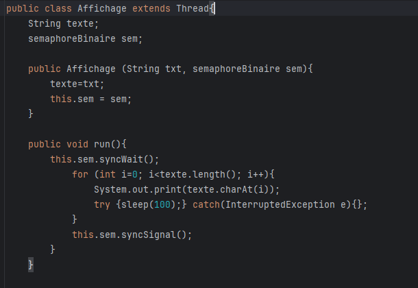

*figure 8 : Méthode run() en utilisant semaphore*

Dans la classe Affichage on crée un objet *sem* de type semaphoreBinaire. Dans la méthode run(), on va bloquer le thread courant en attendant jusqu'à ce que le semaphore *sem* soit disponible. Le reste du code reste inchangé on va afficher la totalité du texte du thread. Une fois l'affichage terminé, on va libérer le semaphore en signalant que le thread a terminé son travail avec la ressource protégée.


*figure 9 : La classe Main en utilisant le semaphore*

Dans la méthode main de la classe Main, on commence par instancier un nouveau semaphore binaire avec pour valeur initiale 1 indiquant qu'il est disponible pour un seul thread à la fois. Puis, nous allons créer quatre threads différents retournant des chaines de caractères différentes partageant le même sémaphore.

On obtient le diagramme des classes suivant : 

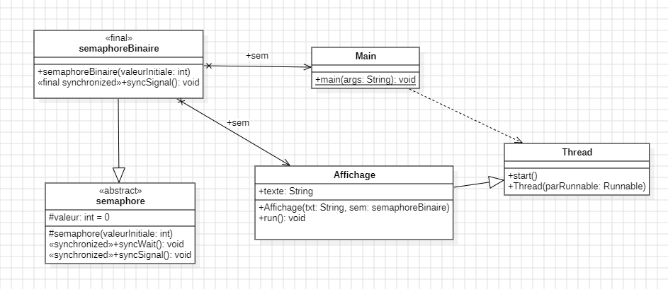

*figure 10 : TP2 Diagramme des classes*

Nous avons les classes semaphoreBinaire, semaphore, main et affichage. La classe semaphoreBinaire hérite de la classe semaphore et est associé à la classe Main grâce à l'élement semaphoreBinaire *sem* crée dans cette classe afin qu'il soit associé à chaque thread. Elle est également associée à la classe Affichage suite à l'ajout du champ *sem* de type semaphoreBinaire. La classe Affichage hérite de la classe Thread. Enfin, Main dépend de la classe Thread suite à l'instanciation et la mise en marche de thread dans cette classe. 

### <a name="p6"></a> Quatrième séance de TP 

Dans cette première partie de la séance, nous avons commencé par reprendre le TP1 sur les mobiles et imaginer une découpe en trois de la fenêtre. Puis, il fallait faire en sorte que une fois arrivé dans la seconde partie de la fenêtre, certains mobiles continuaient à se déplacer tandis que certains devaient s'arrêter. La méthode du semaphore est à utiliser. Une fois la seconde zone libre les mobiles arrêtés pouvaient continuer leur chemin.

Pour cela, nous avons ajouté la partie suivante au code de la classe UnMobile : 

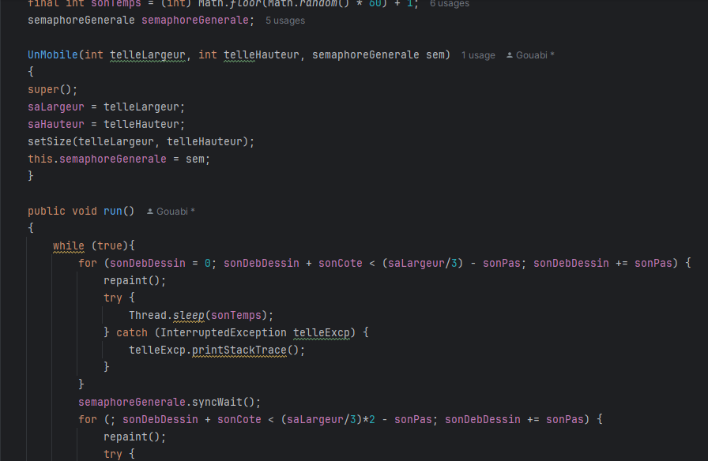

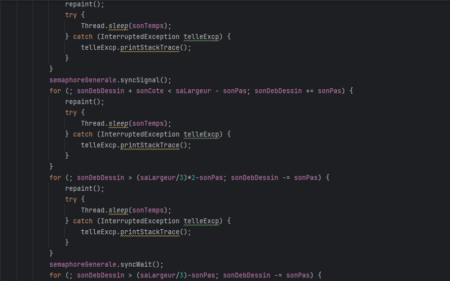

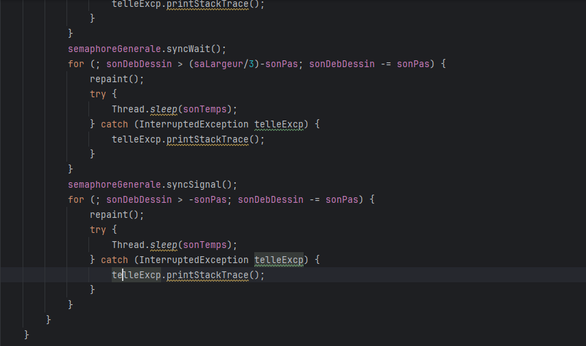

*figure 11 : Classe UnMobile*

On créer les classes semaphore et semaphoreGenerale s'inspirant des classes semaphore et semaphoreBinaire déjà effectuées dans les TP précédents.

On commence par créer un champ semaphoreGenerale de type semaphoreGenerale. Par la suite dans la méthode run, dans un sens (de gauche à droite) on fait en sorte que les mobiles se déplacent dans la première partie de la fenêtre en la divisant par 3. Puis, une fois arrivé au début de la deuxième partie de la fenêtre on fait attendre certains mobiles. Les autres mobiles continuent leur course jusqu'à 2/3 de la fenêtre. Une fois les mobiles arrivés à 2/3 de la fenêtre ils signalent à ceux arrêtés de reprendre et continuent jusqu'à la fin de la fenêtre. Nous effectuons ça de gauche à droite et de droite à gauche. 


*figure 12 : Classe UneFenetre*

Dans le constructeur de la classe fenêtre, nous allons créer une nouvelle instance d'un semaphore de type semaphoreGenerale de valeur 2 ce qui veut dire que 2 threads peuvent accéder simultanément à la ressource partagée. Puis, on passe le sémaphore à la nouvelle instance de UnMobile. 

Dans la deuxième partie de la séance, nous avons assiter au cours sur [les moniteurs](noteCours.md).
Par la suite de cela, nous avons réalisé la première question du TD3. 

Nous avons commencé par créer les classes Bal pour la boite aux lettres, consommateur pour la personne qui récupère la lettre puis producteur en guise de facteur. 

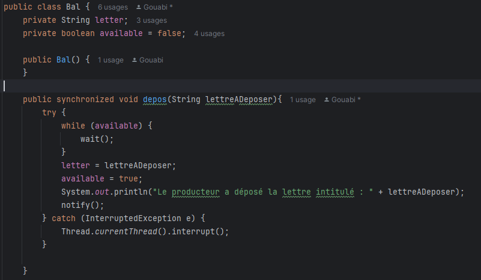

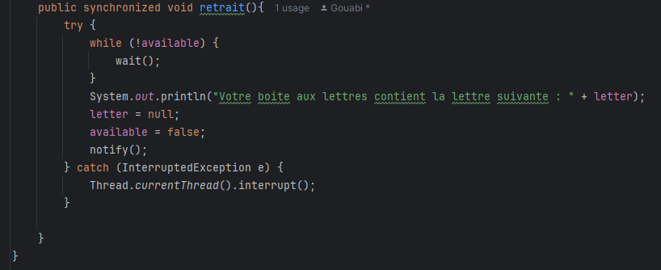

*figure 13 : Classe Bal*

La classe Bal est composée des méthodes depos, pour déposer la lettre et la méthode retrait pour la retirer.
Dans la méthode depos, on commence par attendre si la lettre n'est pas vide ce qui veut dire qu'il y en a déjà une de déposer. Si aucune lettre est déposé on dépose la notre. 
<br>Dans la méthode retrait, on attend si on a aucune lettre dans la boite aux lettres sinon on retire la lettre et on notifie qu'il y a plus rien dans la boite aux lettres. 

Dans la classe consommateur, la méthode run est créé dans laquelle nous allons appeler la méthode retrait pour l'appliquer au champ bal crée pour retirer la lettre. Dans la classe producteur, la méthode run est créé dans laquelle nous allons appeler la méthode depos pour l'appliquer au champ bal créé pour déposer une lettre.

Nous obtenons le diagramme des classes suivants pour l'exercice 1 du TD3 : 

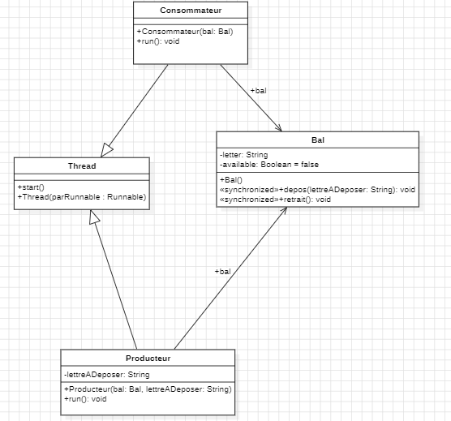

*figure 14 : TD3 Diagramme des classes*

### <a name="p7"></a> Cinquième séance de TP 

Nous avons commencé cette cinquième séance en finissant la deuxième question du premier exercice du TD/TP 2.  
Pour cela il fallait ajouter quelques modifications aux classes Producteur et Consommateur afin de faire en sorte que quand l'utilisateur entre la lettre Q on arrêtait les Threads. 

Voici la classe Consommateur modifiée : 

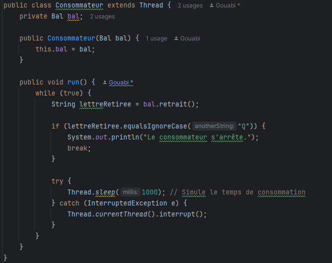

*figure 15 : La classe Consommateur*

Tant que la lettreRetiree n'a pas pour intitulé "Q", on continue de retirer les lettres de la boite aux lettres. Si l'utilisateur entre "Q", un message apparait pour prévenir l'utilisateur que le consommateur s'arrête.

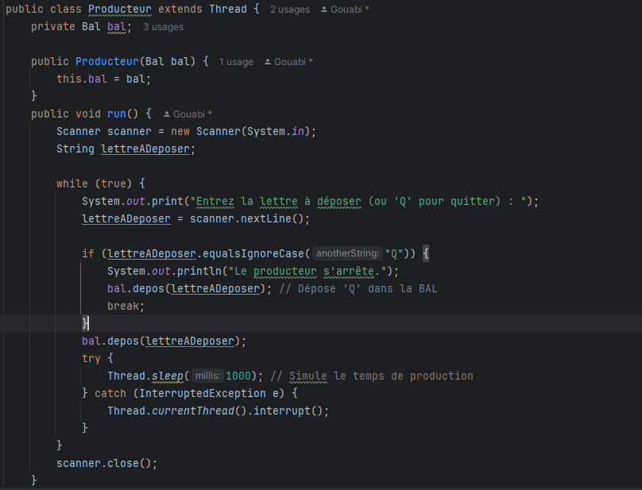

On déclare un scanner permettant de lire les réponses de l'utilisateur. Tant que l'utilisateur n'a pas entré la lettre Q on effectue la boucle qui demande à l'utilisateur de entrer une lettre et la dépose. Si il entre Q alors l'utilisateur reçoit un message en disant que le producteur s'est arrêté. 

Dans la deuxième partie de la séance, la notion d'API concurrent, nous a été introduite. 
Puis on a récupéré le code des classes Boulangerie, Boulanger, Mangeur et Pain à l'adresse : https://blog.paumard.org/cours/java-api/chap05-concurrent-queues.html.
En essayant de tester le code de ses classes on s'est aperçu que des parties du code manquaient notamment des champs. Ainsi l'import de classes et l'intégration de champs et constructeurs ont été ajouté. 

Nous avons importé les éléments suivants dans la classe Boulangerie : 

```java
import java.util.concurrent.ArrayBlockingQueue;
import java.util.concurrent.BlockingQueue;
import java.util.concurrent.TimeUnit;
```

Dans la classe Boulanger, il était nécessaire d'ajouter un champ de type Boulangerie pour pouvoir utiliser l'objet *boulangerie*

```java
public class Boulanger implements Runnable { 

    private Boulangerie boulangerie;

    public Boulanger(Boulangerie boulangerie) {
        this.boulangerie = boulangerie;
    }
}
```
Il était évident de faire de même pour la classe Mangeur en important Random

```java
import java.util.Random;

public  class Mangeur  implements Runnable {
    private Boulangerie boulangerie;
    private Random rand;

    public Mangeur(Boulangerie boulangerie, Random rand) {
        this.boulangerie = boulangerie;
        this.rand = rand;
    }
}
  ```
Enfin, dans la classe Main, il fallait suite à l'ajout du constructeur dans la classe Mangeur, ajouter le champ *rand* dans son appel

```java
// notre mangeur est aussi un runnable
    Mangeur mangeur =  new Mangeur(boulangerie, rand) ;
```
Après avoir modifier ses classes, le diagramme des classes de ce projet a été réalisé : 

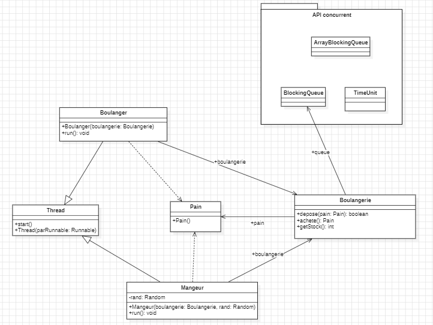

*figure 16 : TP API Diagramme des classes*

Nous avons les classes Boulanger, Boulangerie, Mangeur et Pain ainsi que le package concurrent contenant ArrayBlockingQueue, BlockingQueue et TimeUnit. La classe Boulangerie est associé à BlockingQueue du package concurrent et la classe Pain grâce au champs *queue* de type BlockingQueue qui contient seulement des objets de type Pain. Les classes Boulanger et Mangeur sont associées à la classe Boulangerie grâce au champs *boulangerie*. Elles dépendent toutes les deux de Pain car la classe Boulanger créée une nouvelle instance de Pain et l'ajoute à la Boulangerie tandis que Mangeur essaie d'acheter du pain. Enfin, Boulanger et Mangeur héritent de la classe Thread.  


En fin de séance la partie du cours sur la parallélisation de code nous a été introduite. [Note de cours](noteCours.md)